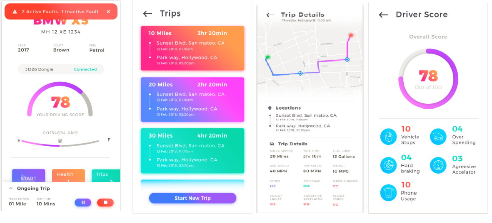

# Mobiliya Fleet

## Getting Started

_Follow these instructions to build and run the project without data; note that
the app will be blank._

1. Clone this repository.
2. Download the appropriate [JDK](http://www.oracle.com/technetwork/java/javase/downloads/jdk8-downloads-2133151.html)
for your system. We are currently on JDK 8.
3. [Install Android Studio](https://developer.android.com/sdk/index.html).
4. `cd` into the project repo and run `make bootstrap` to bootstrap your Android
   development environment. Keep an eye on the output to see if any manual steps
   are required.
5. Import the project. Open Android Studio, click `Open an existing Android
   Studio project` and select the project. Gradle will build the project.
6. Run the app. Click `Run > Run 'app'`. After the project builds you'll be
   prompted to build or launch an emulator.
   
